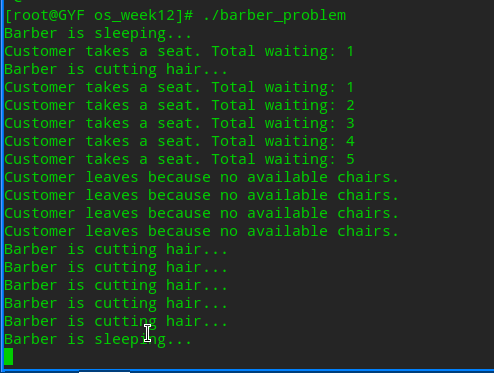

# 第二次上机：Linux下多线程编程实践

## 一、熟悉API，完成示例代码的编译与执行
### 1.nosync-ex.c
```C
#include <pthread.h>
#include <stdio.h>
int sum = 0;
void* thread(void*) {
    int i;
    for (i = 0; i < 1000000; i++)
        sum += 1;
}
int main(void) {
    pthread_t tid1, tid2;
    pthread_create(&tid1, NULL, thread, NULL);
    pthread_create(&tid2, NULL, thread, NULL);
    pthread_join(tid1, NULL);
    pthread_join(tid2, NULL);
    printf("1000000 + 1000000 = % d\n", sum);
    return (0);
}
```
```bash
gcc -o nosync-ex nosync-ex.c -lpthread
time ./nosync-ex
```

### 2.mutex-ex.c
```C
#include <pthread.h>
#include <stdio.h>
int sum = 0;
pthread_mutex_t mutex;
void* thread(void*) {
    int i;
    for (i = 0; i < 1000000; i++) {
        pthread_mutex_lock(&mutex);
        sum += 1;
        pthread_mutex_unlock(&mutex);
    }
}
int main(void) {
    pthread_t tid1, tid2;
    pthread_mutex_init(&mutex, NULL);

    pthread_create(&tid1, NULL, thread, NULL);
    pthread_create(&tid2, NULL, thread, NULL);
    pthread_join(tid1, NULL);
    pthread_join(tid2, NULL);
    printf("1000000 + 1000000 = % d\n", sum);
    return (0);
}
```
```bash
gcc -o mutex-ex mutex-ex.c -lpthread
time ./mutex-ex
```

### 3.sem-ex.c
```C
#include <pthread.h>
#include <semaphore.h>
#include <stdio.h>
int sum = 0;
sem_t sem;
void* thread(void*) {
    int i;
    for (i = 0; i < 1000000; i++) {
        sem_wait(&sem);
        sum += 1;
        sem_post(&sem);
    }
}
int main(void) {
    pthread_t tid1, tid2;
    sem_init(&sem, 0, 1);

    pthread_create(&tid1, NULL, thread, NULL);
    pthread_create(&tid2, NULL, thread, NULL);
    pthread_join(tid1, NULL);
    pthread_join(tid2, NULL);
    printf("1000000 + 1000000 = %d\n", sum);
    return (0);
}
```
```bash
gcc -o sem-ex sem-ex.c -lpthread
time ./sem-ex
```

## 二、实现生产者-消费者模型
**producer_consumer.c**
```C
#include <pthread.h>
#include <stdio.h>
#include <stdlib.h>
#include <unistd.h>

#define BUFFER_SIZE 5

int buffer[BUFFER_SIZE];
int in = 0;
int out = 0;

pthread_mutex_t mutex;
pthread_cond_t full;
pthread_cond_t empty;

// 通过互斥锁mutex和条件变量full、empty实现同步与互斥

void *producer(void *arg)
{
    while (1)
    { // 无限循环
        pthread_mutex_lock(&mutex);
        while ((in + 1) % BUFFER_SIZE == out)
        {
            pthread_cond_wait(&empty, &mutex);
        }

        buffer[in] = rand() % 100;
        printf("Producer produced: %d\n", buffer[in]);
        in = (in + 1) % BUFFER_SIZE;

        pthread_cond_signal(&full);
        pthread_mutex_unlock(&mutex);

        usleep(rand() % 1000000);
    }
}

void *consumer(void *arg)
{
    while (1)
    { // 无限循环
        pthread_mutex_lock(&mutex);
        while (in == out)
        {
            pthread_cond_wait(&full, &mutex);
        }

        printf("Consumer consumed: %d\n", buffer[out]);
        out = (out + 1) % BUFFER_SIZE;

        pthread_cond_signal(&empty);
        pthread_mutex_unlock(&mutex);

        usleep(rand() % 1000000);
    }
}

int main()
{
    pthread_t producer_thread, consumer_thread;

    srand(time(NULL));
    // 创建线程
    pthread_create(&producer_thread, NULL, producer, NULL);
    pthread_create(&consumer_thread, NULL, consumer, NULL);

    // 添加退出机制，比如使用信号或超时
    pthread_join(producer_thread, NULL);
    pthread_join(consumer_thread, NULL);
}
```
```bash
gcc -o producer_consumer producer_consumer.c -lpthread
./producer_consumer
```


本代码实现了一对一的生产者-消费者模型，支持最大商品的个数为5个。生产者生产商品，消费者消费商品。生产者和消费者通过互斥锁mutex和条件变量full、empty实现同步与互斥。生产者生产商品时，如果缓冲区满，则等待消费者消费商品；消费者消费商品时，如果缓冲区空，则等待生产者生产商品。

## 三、代码阅读
### 1.pthread-ex01
i接收了pthread_exit()返回的42，结果为42。
### 2.pthread-ex02
无输出结果，exit直接终止程序。
### 3.pthread-ex03
0或42都有可能被打印，不知道谁先进行。
### 4.pthread-ex04
未定义行为，使用了thread_detach()函数，并调用pthread_join()函数，但是线程分离后并不需要调用pthread_join()函数。
### 5.pthread-ex05
42或31都有可能，执行具有异步性，不知道调度方式。
### 6.pthread-ex06
Thread 1或Thread 0谁在前都有可能，执行具有异步性，不知道调度方式。
### 7.pthread-ex07
都访问的是i的地址，打印两个2。
## 四、理发师问题
```C
#include <pthread.h>
#include <stdio.h>
#include <stdlib.h>
#include <unistd.h>

#define NUM_CHAIRS 5

pthread_mutex_t mutex = PTHREAD_MUTEX_INITIALIZER;
pthread_cond_t barber_sleep = PTHREAD_COND_INITIALIZER;
pthread_cond_t customer_wait = PTHREAD_COND_INITIALIZER;

int waiting_customers = 0;

void* barber(void* arg) {
    while (1) {
        pthread_mutex_lock(&mutex);

        while (waiting_customers == 0) {
            printf("Barber is sleeping...\n");
            pthread_cond_wait(&barber_sleep, &mutex);
        }

        printf("Barber is cutting hair...\n");
        waiting_customers--;

        pthread_mutex_unlock(&mutex);

        sleep(rand() % 3 + 1);
    }
}

void* customer(void* arg) {
    pthread_mutex_lock(&mutex);

    if (waiting_customers < NUM_CHAIRS) {
        waiting_customers++;
        printf("Customer takes a seat. Total waiting: %d\n", waiting_customers);

        pthread_cond_signal(&barber_sleep);

        pthread_mutex_unlock(&mutex);

        sleep(rand() % 5 + 1);
    } else {
        printf("Customer leaves because no available chairs.\n");
        pthread_mutex_unlock(&mutex);
    }

    pthread_exit(NULL);
}

int main() {
    pthread_t barber_thread, customer_threads[NUM_CHAIRS + 5];
    srand(time(NULL));
    pthread_create(&barber_thread, NULL, barber, NULL);
    for (int i = 0; i < NUM_CHAIRS + 5; i++) {
        pthread_create(&customer_threads[i], NULL, customer, NULL);
    }
    pthread_join(barber_thread, NULL);
    for (int i = 0; i < NUM_CHAIRS + 5; i++) {
        pthread_join(customer_threads[i], NULL);
    }
    return 0;
}
```
```bash
gcc -o barber_problem barber_problem.c -lpthread
./barber_problem
```


本代码实现了一个理发师-顾客模型，理发师负责理发，顾客负责等待。理发师和顾客通过互斥锁mutex和条件变量barber_sleep、customer_wait实现同步与互斥。理发师睡觉时，如果没有顾客需要理发，则等待顾客；顾客等待理发时，如果没有空位，则离开。理发师理发时，顾客可以进入，理发师等待顾客。理发师理发完后，顾客可以离开。理发师理发速度随机，顾客等待时间随机。
## 五、总结
本次实践中，我们学习了Linux下多线程编程的基本概念和API，并通过示例代码和理发师问题，熟悉了多线程编程的基本流程和原理。通过阅读代码，我们了解到多线程编程的一些基本原理，并掌握了如何使用pthread_mutex_lock()、pthread_mutex_unlock()、pthread_cond_wait()、pthread_cond_signal()等API实现同步与互斥。最后，我们实现了一个理发师-顾客模型，掌握了多线程编程的基本概念和API的使用方法。具体提交记录请查看github仓库。
```bash
git clone https://github.com/Peppa12138/OS_HW.git
```