#   安装openEuler😘

## 一、安装准备🤔

### 1. VirtualBox安装

&emsp;[点击](https://www.virtualbox.org)下载VirtualBox安装包并安装。

### 2. 下载openEuler镜像

&emsp;[点击进入官网](https://www.openeuler.org/)，选择合适的版本进行下载。这里我选择了22.03和24.03的镜像，本篇markdown文档基于**22.03**版本进行安装。

## 二、创建虚拟机🧐

### 1. 打开VirtualBox，点击`新建`按钮，选择`创建虚拟机`对话框。
### 2. 进行如下配置：
>&emsp;填入虚拟电脑名称，选择合适的文件夹。
>
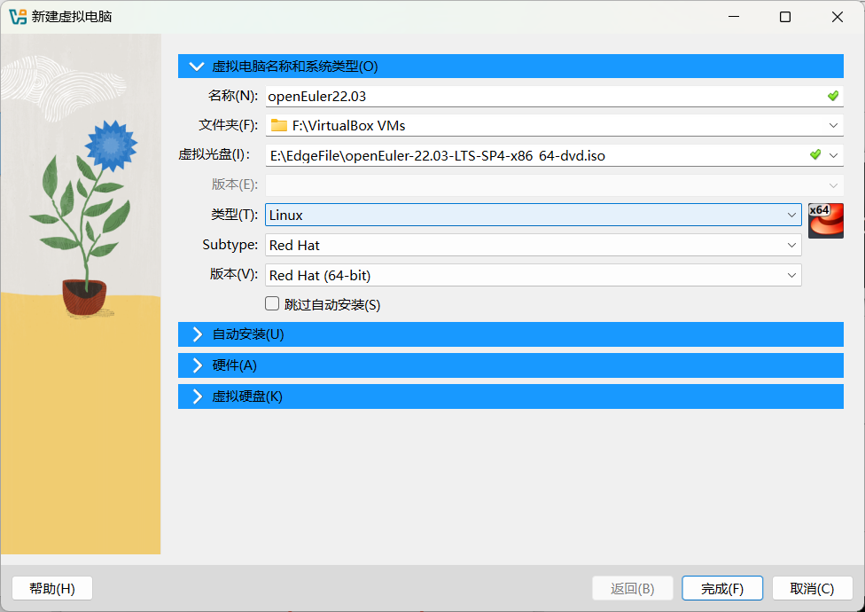
>&emsp;在自动安装的界面设置用户名和密码。
>
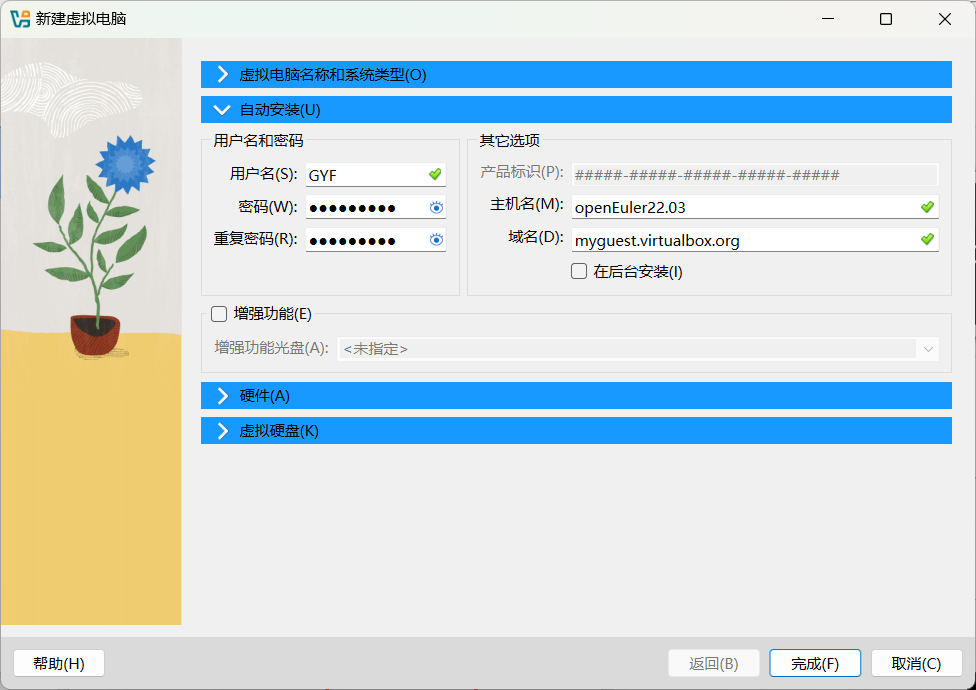
>&emsp;在硬件的界面根据需要选择合适的内存大小及处理器核数。
>
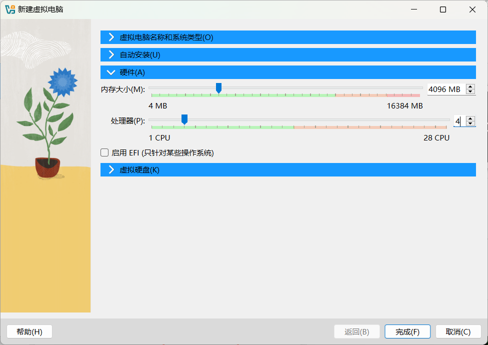
>&emsp;在虚拟硬盘的界面，为整个openEuler系统预设一个最大的磁盘空间，考虑到是教学使用，理论上不需要太大的空间，故设置为20GB。
>
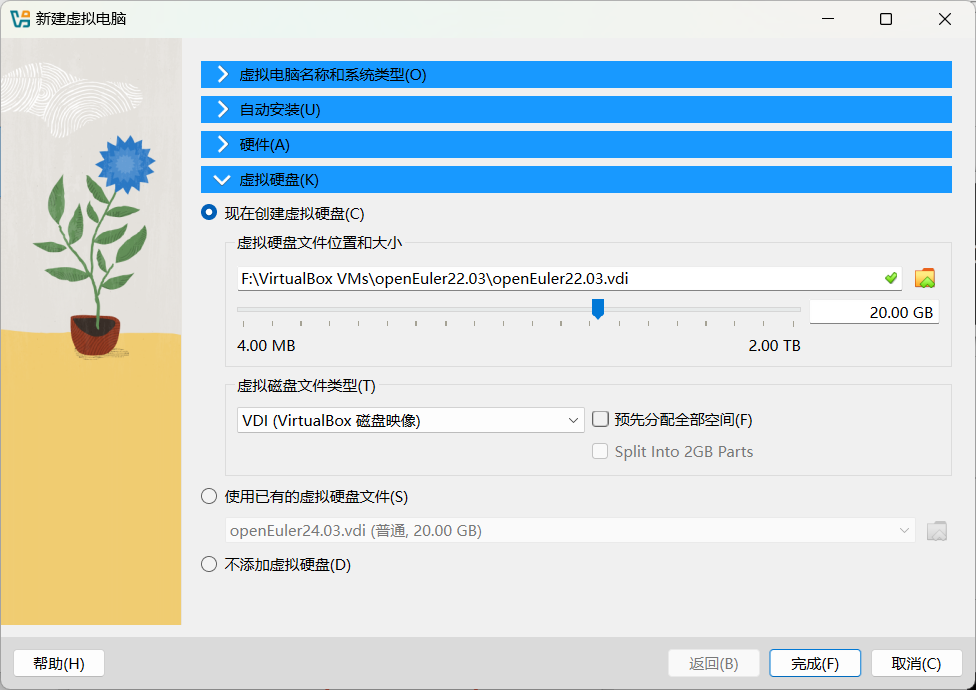
### 3. 点击`完成`按钮，等待虚拟机创建完成。
### 4. 点击`设置`按钮，查看并设置部分选项：
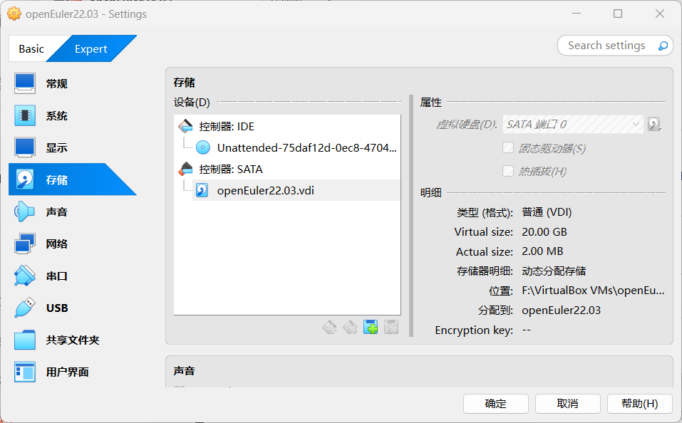
>&emsp;选择网络，对网络进行设置，选择网卡的连接方式为桥接网卡，并且允许虚拟电脑。
>
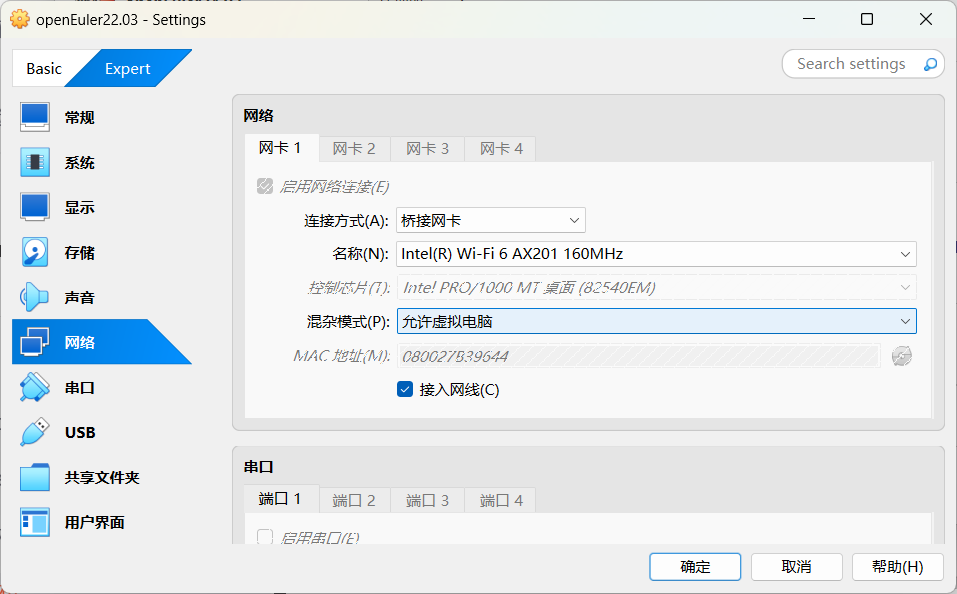
### 5. 点击`重启`按钮，重新启动虚拟机。

## 三、安装openEuler😃

### 1. 选择语言
>&emsp;根据语言熟悉程度，我选择使用中文进行安装过程。
>
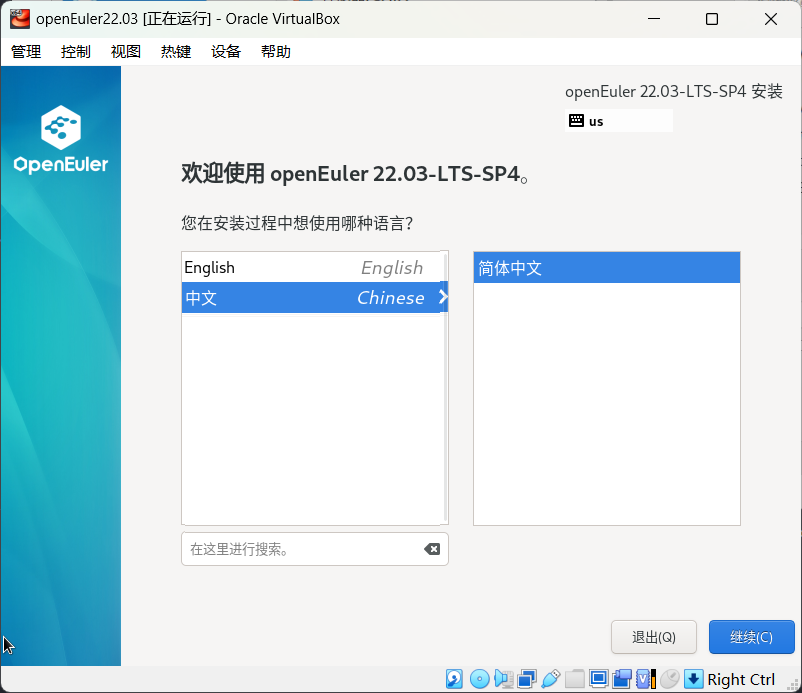
### 2.点击`安装目的地`，选择默认配置
>&emsp;安装地默认就好，不需要改
>
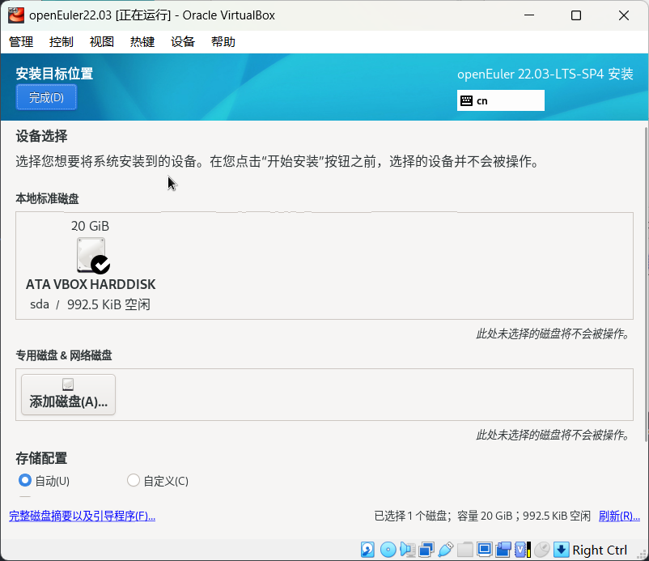

### 3. 点击`时间和日期`，查看配置
>&emsp;选择时区，默认就好，不需要改
>
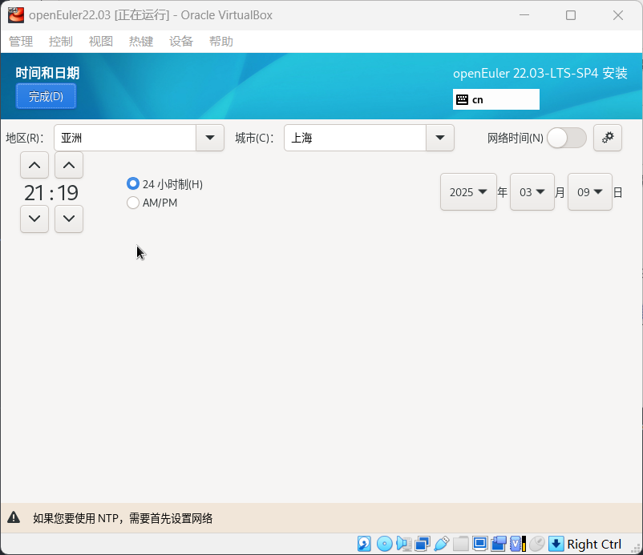
### 4. 点击`网络和主机名`，进行如下配置
>&emsp;选择网络，选择`以太网`，设置IP地址，子网掩码，网关，DNS服务器。
>
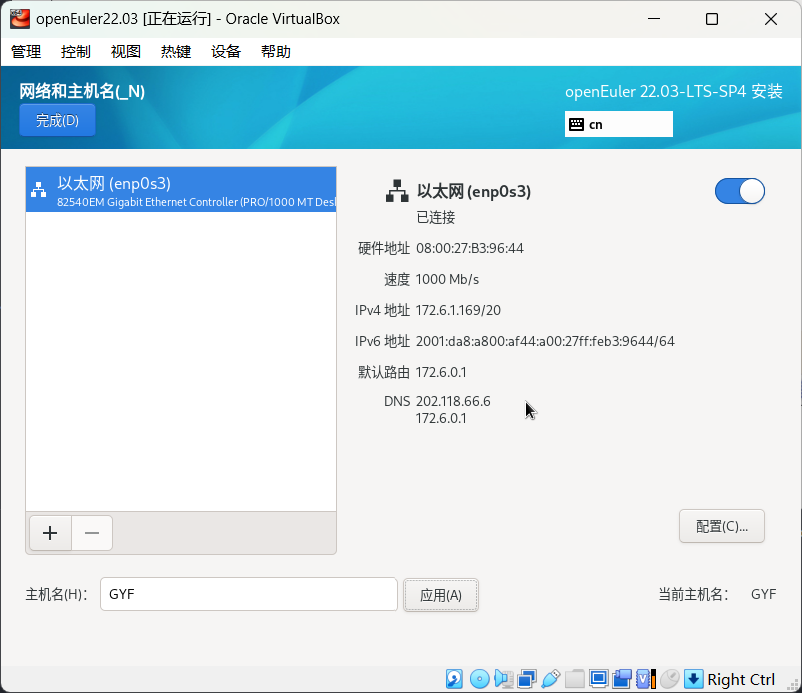
### 5. 点击`软件选择`，进行如下配置
>&emsp;选择安装的软件，我这边选择了一些软件预装
>
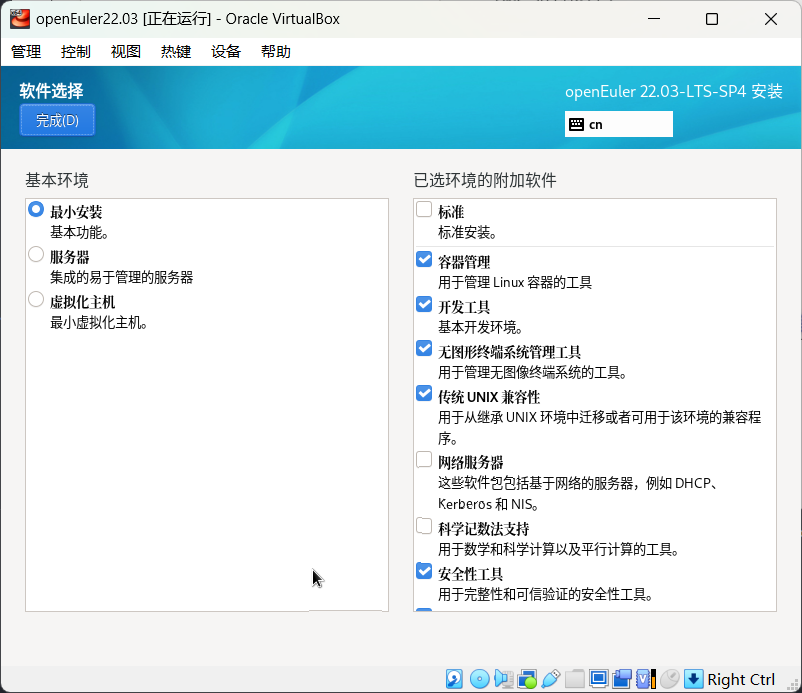
### 6. 点击`Root账户`和`创建用户`，创建一个root账户和普通用户
>&emsp;输入root密码，确认密码，创建用户，输入用户名和密码，确认密码。
>
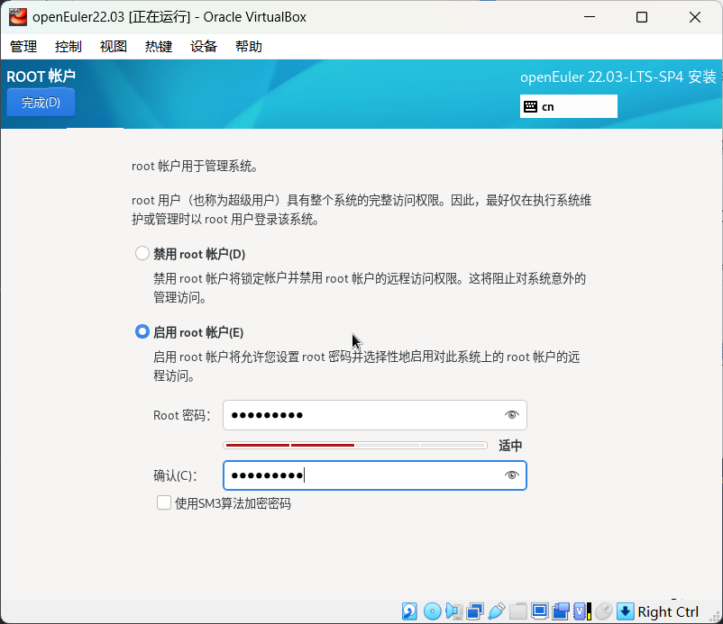
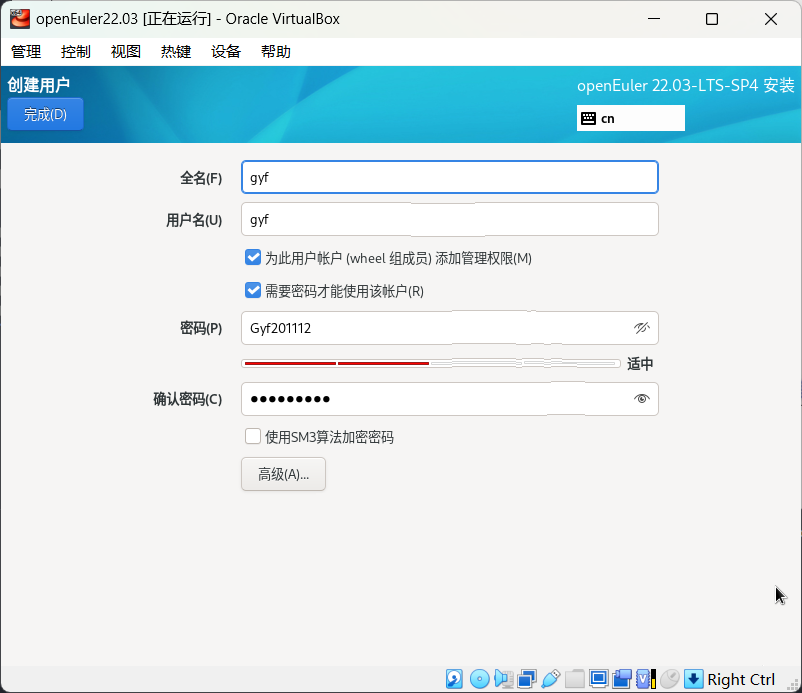
### 7. 点击`安装`，等待安装完成
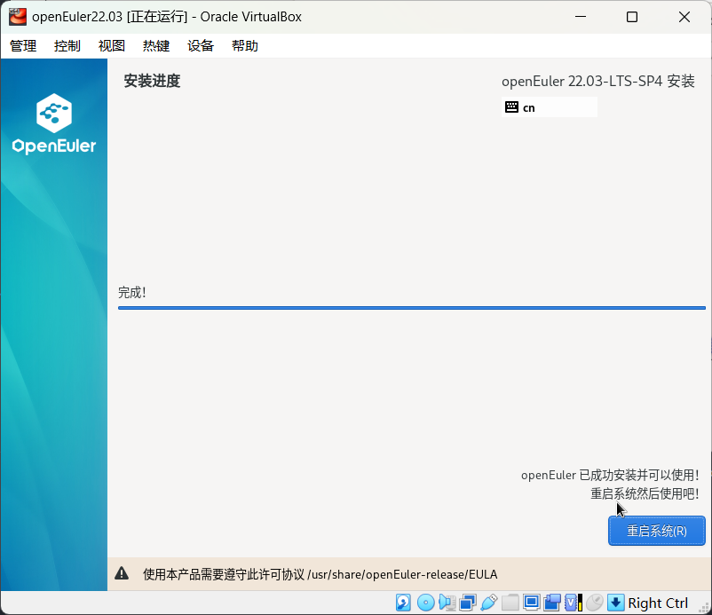
### 8. 点击`重启`，重启系统
### 9. 登录系统，输入root密码，进入系统
>&emsp;输入root密码，进入系统，注意：Linux系统输入密码时是不会明文显示出来的
> 
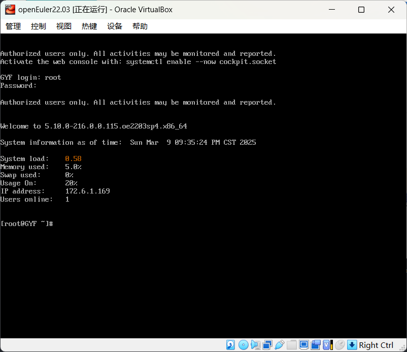

## 四、配置VSCodeMarkdown编辑插件🎉
>&emsp;下载配置了两个插件Markdown All in One和Markdown Preview Enhanced，可以方便地编写Markdown文档。
>

## 五、完结撒花🌹
&emsp;**本次VirtualBox安装OpenEuler总体上还算顺利，目前只配置了命令行的环境，后续还会考虑配置GUI环境。浅浅学习了一下Markdown的语法。**