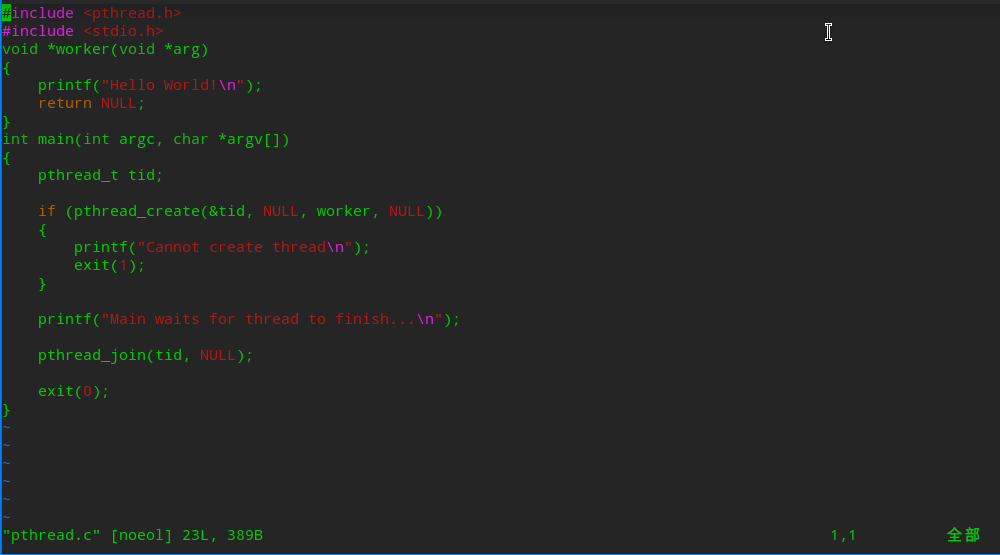
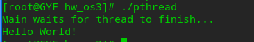
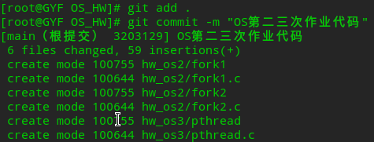
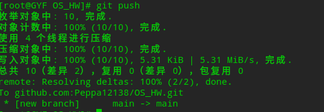

# OpenEuler配置git并编译pthread代码
## 一、检查和配置git
### 1.检查git环境
```bash
    git --version
```
### 2.全局配置git仓库
```bash
    git config --global user.name "GYF"
    git config --global user.email "gyf2528357407@foxmail.com"
```

### 3.检查刚刚配置的git环境
```bash
    git config --global --list
```

### 4.获取ssh秘钥并且查看生成的公钥
```bash
    ssh-keygen -t rsa -b 4096 -C "gyf2528357407@foxmail.com"
    cat ~/.ssh/id_rsa.pub
```
### 5.点击github的setting配置ssh并在github上新建一个仓库并且clone到本地
```bash
    git clone git@github.com:Peppa12138/OS_HW.git
```

## 二、代码编写
### 1.移动到OW_HW仓库
```bash
    cd OS_HW
```
### 2.移动之前的文件到新文件夹
```bash
    mkdir hw_os2
    mv ../../openEuler_school_practice/week3_work/fork1.c ./
    mv ../../openEuler_school_practice/week3_work/fork2.c ./
```
### 3.重新编译两个文件
```bash
    gcc fork1.c -o fork1
    gcc fork2.c -o fork2
```
### 4.编写pthread.c
```bash
    cd ../
    mkdir hw_os3
    touch pthread.c
    vim pthread.c
```
然后就是愉快地代码编写时间

### 5.编译并运行pthread
```bash
    gcc pthread.c -o pthread
    ./pthread
```

## 三、上传代码至git仓库
```bash
    cd ../
    git add .
    git commit -m "OS第二三次作业代码"
    git push
```


## 四、总结
**本次作业在OpenEuler上配置了git，并且成功提交了pthread代码，初步了解了pthread函数的作用**