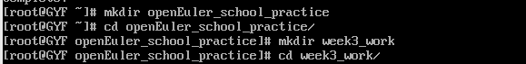
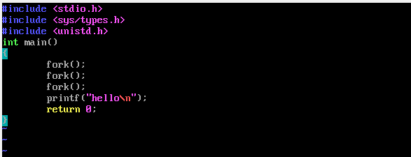
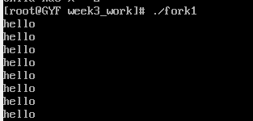
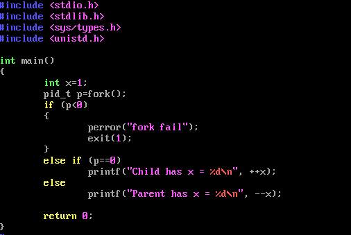

# 第二次作业：openEuler命令行下编辑并编译示例代码

## 一、环境检查、配置
### 1. 检查更新软件包索引
```
    dnf update
```
### 2. 准备代码编辑环境
```
    dnf install vim
    vim --version
    gcc --version
```
**由于openEuler默认安装gcc，所以不需要单独安装。**
## 二、编译示例代码
### 1. 在根目录下创建文件夹并进入
```
    mkdir openEuler_school_practice
    cd openEuler_school_practice
    mkdir week3_work
    cd week3_work
```

### 2. 创建文件
```
    touch fork1.c
    touch fork2.c
```
### 2. 编辑并执行代码
#### 2.1 fork1.c
##### 2.1.1 编写代码
```
    vim fork1.c
```

```C
#include <stdio.h>
#include <sys/types.h>
#include <unistd.h>
int main()
{
    fork();
    fork();
    fork();
    printf("hello\n");
    return 0;
}
```


##### 2.1.2 编译代码
```
    gcc fork1.c -o fork1
```
##### 2.1.3 执行代码
```
    ./fork1
```


#### 2.2 fork2.c
##### 2.2.1 编写代码
```
    vim fork2.c
```

```C
#include <stdio.h>
#include <stdlib.h>
#include <sys/types.h>
#include <unistd.h>
int main()
{
    int x = 1;
    pid_t p = fork();
    if(p<0){
    perror("fork fail");
    exit(1);
}
    else if (p == 0)
    printf("Child has x = %d\n", ++x);
    else
    printf("Parent has x = %d\n", --x);
    return 0;
}
```

##### 2.2.2 编译代码
```
    gcc fork2.c -o fork2
```
##### 2.2.3 执行代码
```
    ./fork2
```


## 三、总结
> **本次作业利用vim编辑器编写并编译了两个示例代码，并展示了fork()函数的用法，学习了简单的vim命令以及简单的gcc命令，以前一般都是用的VScode的图形化功能进行的编辑编译，这次通过命令行对C语言程序的编译程序的方法有了一定的理解。**